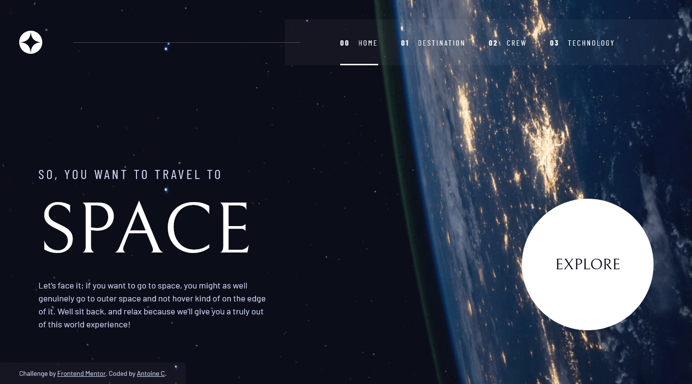
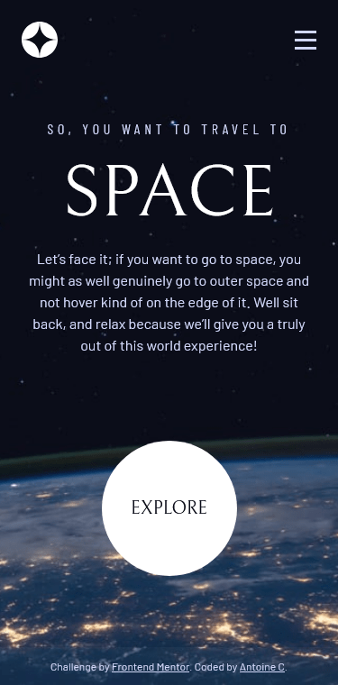

# Frontend Mentor - Space tourism website solution

This is a solution to the [Space tourism website challenge on Frontend Mentor](https://www.frontendmentor.io/challenges/space-tourism-multipage-website-gRWj1URZ3). Frontend Mentor challenges help you improve your coding skills by building realistic projects.

## Table of contents

- [Overview](#overview)
  - [The challenge](#the-challenge)
  - [Screenshot](#screenshot)
  - [Links](#links)
- [My process](#my-process)
  - [Built with](#built-with)
  - [What I learned](#what-i-learned)
  - [Continued development](#continued-development)
  - [Useful resources](#useful-resources)
- [Author](#author)

## Overview

### The challenge

Users should be able to:

- View the optimal layout for each of the website's pages depending on their device's screen size
- See hover states for all interactive elements on the page
- View each page and be able to toggle between the tabs to see new information

### Screenshot

- Desktop (1440x800)



- Mobile (375x760)



### Links

- Solution URL: [Add solution URL here](https://your-solution-url.com)
- Live Site URL: [https://space-tourism-astro.vercel.app/](https://space-tourism-astro.vercel.app/)

## My process

### Built with

- Semantic HTML5 markup
- CSS custom properties
- Flexbox
- CSS Grid
- Mobile-first workflow
- [Typescript](https://www.typescriptlang.org/)
- [Astro](https://astro.build/)
- [Postcss](https://postcss.org/) - A tool for transforming CSS with JavaScript.

### What I learned

#### General Feeling

This is the first frontend mentor challenge I completed with access to the figma files. It was really helpfull especially for typography and spacing.

I think that the most usefull lesson I learned going throught this challenge is to take more time scanning the design and thinking about the similarities between each page.

I was able to refactor my CSS multiple times to extract some page scoped styles in some global classes.

This is the grid layout i used in all the pages:

```css
.grid-container {
  flex: 1;
  display: grid;
  width: min(100%, calc(85rem + (var(--gutters-inline) * 2)));
  margin-inline: auto;
  column-gap: var(--container-gap, 2rem);
  text-align: center;
  grid-auto-rows: var(--container-auto-rows, min-content);
  padding: var(--container-padding, var(--gutters-block) var(--gutters-inline) var(--gutters-bottom-clamp));
}

.grid-container p {
  max-width: 48ch;
}

@media (--screen-tablet) {
  .grid-container {
    column-gap: var(--container-gap, 4rem);
  }
}

@media (--screen-desktop) {
  .grid-container {
    grid-template-columns: var(--container-template-columns, repeat(2, 1fr));
    text-align: left;
  }
}
```

As you can see I also used `CSS custom properties` to allow some tweaking of the global class in the pages.

#### Astro Build

First time using Astro and it is awesome ✨. As they say in the docs it is a tool to build content focused multipage websites. Since there is almost no javascript in this project (Only the navbar) I thought it was the perfect fit.

It also comes with typescript by default so this is a **+++** !

#### Postcss Preset Env - Postcss plugin

This plugin enables some futuristic CSS features. Since i used SCSS recently I thought that I would give Postcss a try this time.

```css
@custom-media --screen-mobile-only (width < 640px);
@custom-media --screen-tablet (width >= 640px);
@custom-media --screen-tablet-only (640px <= width < 960px);
@custom-media --screen-desktop (width >= 960px);

@custom-selector :--heading h1, h2, h3, h4, h5, h6;
```

However to make sure that your **CSS does not break** in the build step you need to add this in you postcss config:

```js
module.exports = {
  plugins: [
    postcssPresetEnv({
      stage: false,
      features: {
        'custom-media-queries': true,
        'media-query-ranges': true,
        'custom-selectors': true,
      },
      // The two lines below are required !!IMPORTANT
      importFrom: './src/styles/global.css', // File with the custom variables
      exportTo: './src/**/*.astro', // Inject in all .astro files
    }),
  ],
};
```

#### Accessibility Features

- Skip to main content

Open any page and press tab to focus the **Skip to main content** link. It allows user navigating with keyboards to skip the navbar when they arrive on a page.

- Screen Readers only class

I used a `sr-only` utility class inspired by [Tailwindcss](https://tailwindcss.com/) to visually hide content while keeping it in the DOM for screen readers.

```css
.sr-only {
  position: absolute;
  width: 1px;
  height: 1px;
  padding: 0;
  margin: -1px;
  overflow: hidden;
  clip: rect(0, 0, 0, 0);
  white-space: nowrap;
  border: 0;
}
```

- aria attributes

I used many aria attributes to improve accessibity especially in the navbar.

```jsx
<nav class="flex">
  <button class="mobile-nav-toggle" aria-controls="primary-navigation" aria-expanded="false">
    <span class="sr-only">Menu</span>
  </button>
  <ul id="primary-navigation" data-visible="false" class="primary-navigation bg-glass flex">
    {BASE_ROUTES.map((route, index) => (
      <li>
        <a
          class:list={[
            'nav-link underline-indicator uppercase text-light ls-wider ff-condensed fs-nav',
            { active: route === currentRoute },
          ]}
          href={generateUrl(route)}>
          <span aria-hidden="true">{index.toString().padStart(2, '0')}</span>
          {route}
        </a>
      </li>
    ))}
  </ul>
</nav>
```

### Continued development

I think that I light create some dropdown menus in the navbar for the subroutes.

### Useful resources

- [Astro Documentation](https://docs.astro.build/en/getting-started/) - Astro is an all-in-one web framework for building fast, content-focused websites.
- [Postcss Preset Env](https://preset-env.cssdb.org/) - Start using modern CSS today.

## Author

- Frontend Mentor - [@yourusername](https://www.frontendmentor.io/profile/yourusername)
